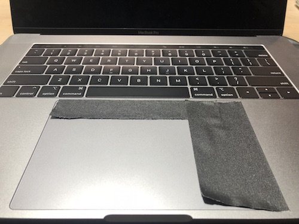
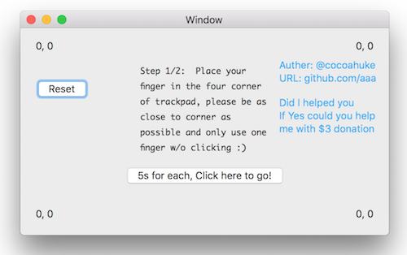
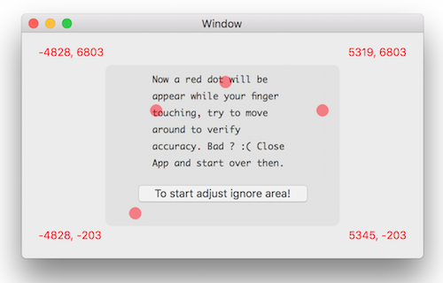
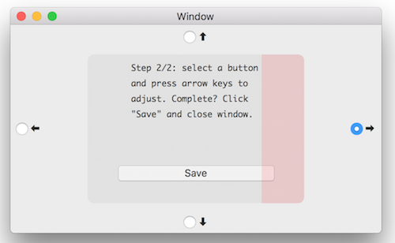

# Shrink Trackpad - Mac App
Solve the Apple Macbook "oversized" trackpad problem.

[](donatebtc.txt)
[](https://www.paypal.com/cgi-bin/webscr?cmd=_s-xclick&hosted_button_id=EQDXSYW8Z23UY)

Is this a joke XD ?


# How to use
1. Download app from release

2. Move App to Application folder

3. Disable SIP  
In order to be functional, I have to load code into kernel, and that require a valid distribute code signature which need purchase from Apple, since I don't have that, disable SIP for loading code to kernel is necessary.
If someone willing to sign for me, appreciate!

4. Run app with root   
It's for safety, app has to run with root.  

Open Terminal and type
```
sudo /Applications/Shrink Trackpad.app/Contents/MacOS/app_shrinkTrackpad
```
Enter your login password in the terminal.   

5. You should able to see the UI right now, follow the instruction from app window, only two steps


Tested on High Sierra, 15inch Macbook pro 2018.  
It should compatible with all macbooks (include old macbook equipped with perfect size trackpad) and macOS version include and above 10.12. (Also should be working on 10.10/10.11 If compile by a older version Xcode)

The **reset** button in first page is for clear the saved config, eg. If you've already setted ignore area,  and you want change that after you closed app, click **reset** for clear all setted ignore config, enable full trackpad!

It should automatically run everytime after you login!
Everything is open source, be rest assured!

I'll fix typo later.

Donation is welcome!  
If you have problem, open a issue.




